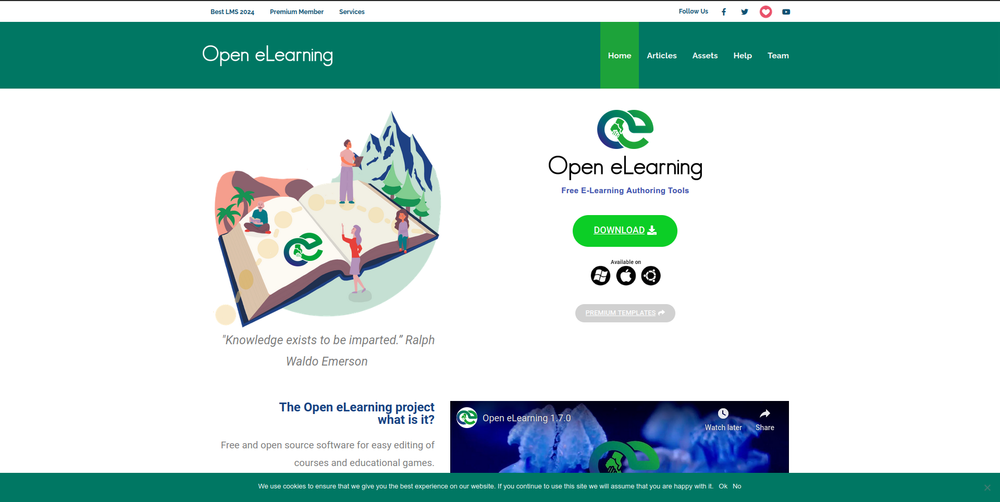
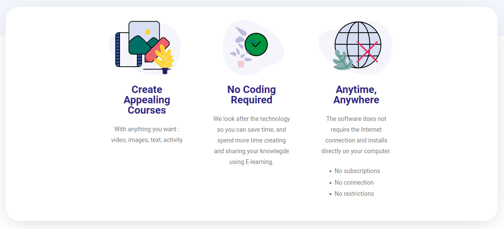
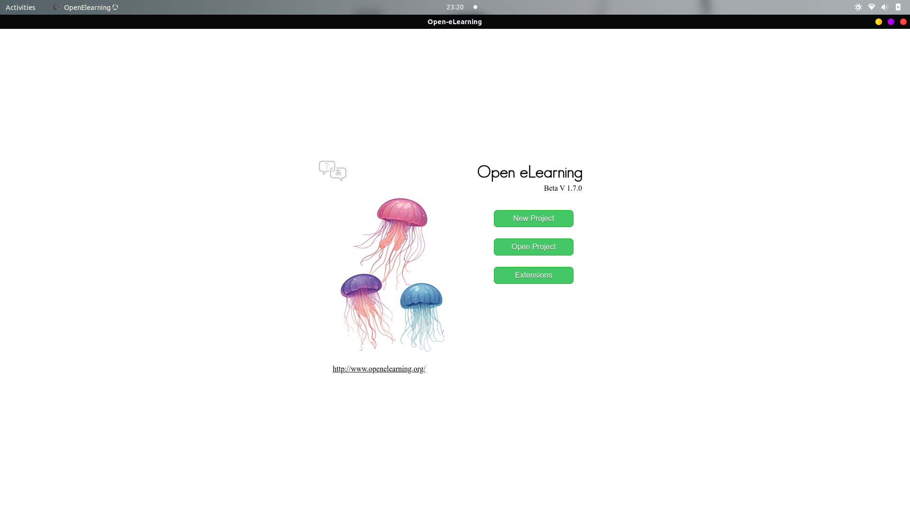
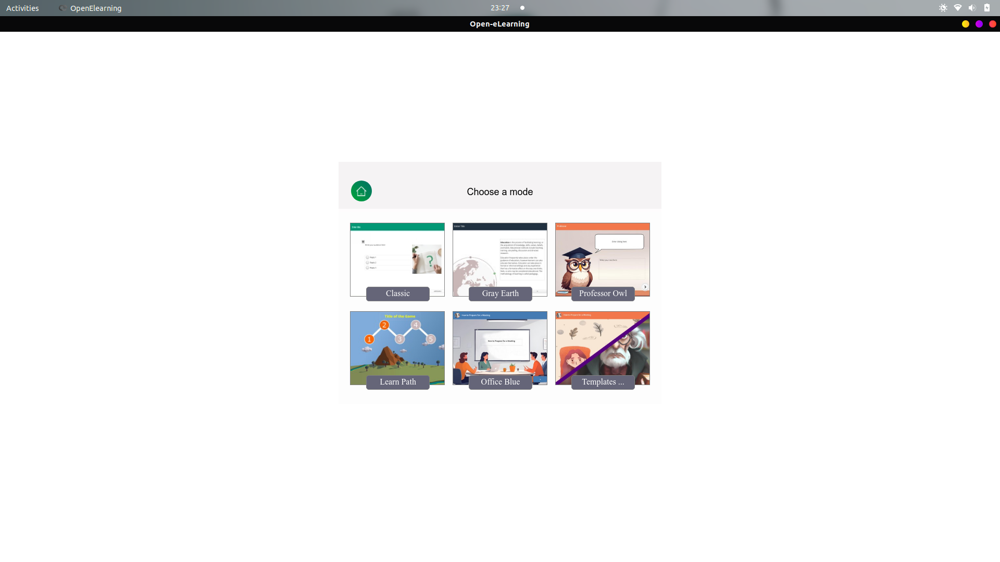
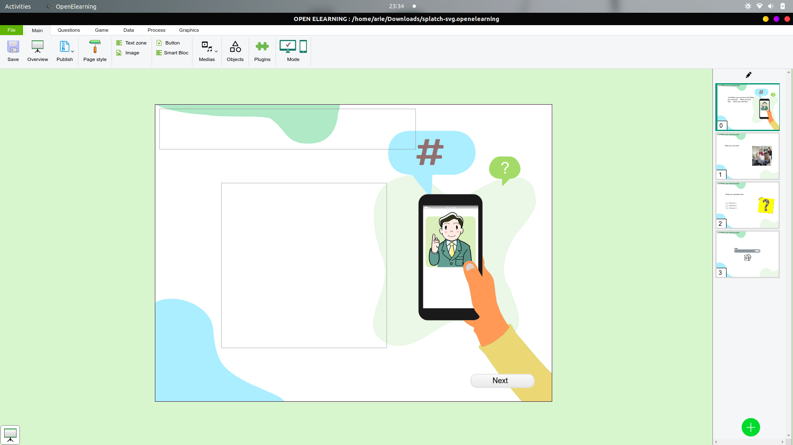
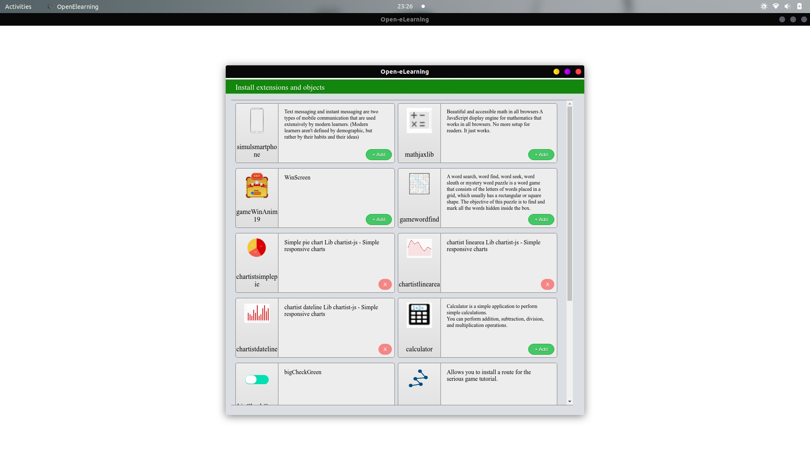

# Open eLearning

Open eLearning adalah perangkat lunak open-source yang dirancang sebagai alat authoring untuk membuat konten e-learning. Didownload oleh **78.811** kali sejak tahun **2018**. Alat ini populer karena menawarkan solusi yang sepenuhnya gratis dengan fitur canggih untuk mendesain kursus online. Open eLearning kompatibel dengan SCORM, memungkinkan pengguna untuk mengintegrasikan konten ke dalam Learning Management Systems (LMS) dengan mudah. Open eLearning dikunjungi pada laman [https://www.openelearning.org](https://www.openelearning.org/).

Open eLearning dapat di pasang di **Windows, MacOs dan Linux**.

## Fitur

### 1. Create Appealing Courses
Salah satu fitur unggulan dari Open eLearning adalah kemampuannya membantu pengguna merancang kursus yang tidak hanya informatif tetapi juga memikat secara visual. Fitur ini memungkinkan penyisipan elemen multimedia seperti gambar, video, dan animasi interaktif, sehingga materi tidak monoton dan lebih mudah dipahami peserta.

Selain itu Open eLearning menyediakan template bawaan yang mempermudah proses desain. Pengguna dapat langsung memilih template, menyesuaikan konten, dan menambahkan elemen kreatif tanpa perlu membangun dari nol. Hasil akhirnya adalah kursus yang terlihat profesional dan menarik, yang tentunya membuat peserta lebih semangat dalam belajar.
### 2. No Coding Required
Kelebihan lainnya adalah Open eLearning dirancang untuk siapa saja, bahkan bagi pengguna tanpa latar belakang teknis. Platform ini menggunakan antarmuka drag-and-drop yang intuitif, sehingga proses pembuatan kursus dapat dilakukan dengan langkah-langkah sederhana tanpa harus menulis kode.

Pengguna cukup memilih elemen yang diinginkan, menyeretnya ke kanvas kerja, dan menyesuaikan tampilan atau fungsinya sesuai kebutuhan. Fitur ini menghilangkan hambatan teknis, membuat proses pembuatan kursus menjadi lebih cepat dan efisien. Dengan begitu, fokus bisa diarahkan sepenuhnya pada penyusunan materi pembelajaran.
### 3. Anytime, Anywhere
Open eLearning mendukung konsep pembelajaran fleksibel yang relevan dengan kebutuhan zaman modern. Kursus yang dibuat menggunakan software ini bersifat responsif, artinya konten dapat diakses melalui berbagai perangkat seperti laptop, tablet, atau smartphone. Peserta tidak perlu khawatir tentang kompatibilitas perangkat atau keterbatasan waktu dan tempat.

Kemudahan ini memberikan kebebasan bagi peserta untuk belajar kapan saja sesuai dengan jadwal mereka, baik itu di rumah, kantor, maupun saat bepergian. Fitur ini sangat penting untuk menjangkau peserta dengan mobilitas tinggi atau yang tinggal di lokasi yang jauh.

# Preview
- Tampilan awal Open eLearning 
  
  Terdapat 3 pilihan menu yaitu :
  1. **New Project** 
   Digunakan untuk membuat projek baru, dapat menggunakan template yang sudah disediakan.

  2. **Open Project** 
   Menu ini digunakan untuk membuka project yang sudah dibuat sebelumnya.
   
  3. **Extension** 
   Pada menun extension kita dapat menambahkan tools tambahan seperti grafik, mathjack dll.
   

# Media yang dibuat
https://arie-zeno.github.io/Tugas_PBK_Open-eLearning/